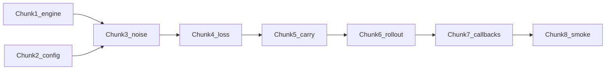

# Residual correction — chunked implementation

## Locked decisions (from plan + your answers)

- **Step aggregation:** `mean` over `num_inference_steps_training` step losses (same pattern as `[run_epoch` L524](src2/hashi_puzzle_solver/trainers/diffusion.py) for `diff-cont`), not sum.
- `**use_component_meta`:** Non-goal in v1 doc — **fail fast** with a clear `ValueError` if `mode == "residual"` and `use_component_meta: true`, rather than silently wrong rewiring.
- **Target logits:** Match `[inject_continuous_noise](src2/hashi_puzzle_solver/utils/diffusion_utils.py)`: per-edge `scale` from the same `scales` tensor used at batch setup (`y_centered * scale_edges` on all edges; mask applies only in the loss).

## Pre-requisite fix (discovered in codebase)

The inter-step carry block in `[diffusion.py` L492–521](src2/hashi_puzzle_solver/trainers/diffusion.py) currently runs the **diff-cont** softmax→center→scale path for **every** mode when `num_inference_steps_training > 1`. Adding `residual` **must** make this block **mode-specific** (`diff-cont` vs `residual` vs `flow-blind` / others) so residual carry is `x_in + delta` (detached) and other modes are not corrupted. This belongs in the same chunk as residual carry (Chunk 5 below).

---

## Chunk 1 — Engine dispatch

**Deliverable:** `[src2/hashi_puzzle_solver/engine.py](src2/hashi_puzzle_solver/engine.py)`: include `"residual"` in the `DiffusionTrainer` branch of `create_trainer`.

**Tests:** New small test file (e.g. `src2/hashi_puzzle_solver/test_engine_residual_mode.py`) that builds a minimal `config` dict with `training.mode: residual` and asserts `create_trainer(...)` returns an instance of `DiffusionTrainer`.

**Commit:** `feat(engine): route residual training mode to DiffusionTrainer`

---

## Chunk 2 — Config skeleton

**Deliverable:** New `[configs/residual_solver.yaml](configs/residual_solver.yaml)` based on `[configs/diffusion_solver_continuous.yaml](configs/diffusion_solver_continuous.yaml)`: set `training.mode: residual`, `loss_weights` with `residual_mse: 1.0` and `degree`/`crossing`/`verify` at 0 as in the plan sketch; set model flags (`use_continuous_edge_labels: true`, `use_noise_head: false`, `use_time_conditioning: false`, etc.).

**Tests:** Lightweight test: `yaml.safe_load` the file and assert required keys exist (`training.mode`, `num_inference_steps_training`, `sigma_max`, `scale_max`, `rollout_init`, `loss_weights.residual_mse`).

**Commit:** `chore(config): add residual_solver.yaml`

---

## Chunk 3 — `run_epoch`: noise injection + tensors in scope

**Deliverable:** In `[src2/hashi_puzzle_solver/trainers/diffusion.py](src2/hashi_puzzle_solver/trainers/diffusion.py)`, add `elif mode == "residual"` beside `diff-cont`: same `alpha_power`, `zero_signal_prob`, `sigma_max`, `scale_min`/`scale_max` sampling and `inject_continuous_noise(...)` call so `alphas`, `sigmas`, `scales`, `num_graphs` are defined the same way as non-carryover `diff-cont`.

**Tests:** Unit test with a **stub batch** (or tiny `Data`/`Batch` from existing test patterns in `[test_diffusion_compat.py](src2/hashi_puzzle_solver/trainers/test_diffusion_compat.py)`): after the injection branch runs, `edge_attr` bridge logit slice is finite and node `x` updated when `use_unused_capacity` is true (delegate assertion to "inject ran" by comparing to pre-inject clone). Prefer testing via a thin helper or by instantiating a minimal `DiffusionTrainer` with mocked `model` if full `run_epoch` is heavy.

**Commit:** `feat(diffusion): residual mode continuous noise injection`

---

## Chunk 4 — `run_epoch`: masked residual MSE + total loss

**Deliverable:**

- For `mode == "residual"`, after forward: `delta = logits`, `x_in` from `bridge_logits` slice, `proposed = x_in + delta`, `target_logits` from one-hot(`y`) with same centering/scaling as diffusion utils (per-edge `scales[edge_batch]`).
- Primary loss: `F.mse_loss` on **puzzle edges only** (`edge_mask`), logged in the epoch results dict as `**residual_mse`** (not `ce`).
- **Total loss:** `loss_weights.get("residual_mse", 1.0) * residual_mse + degree/crossing/verify` using existing `[compute_degree_violation_loss` / `compute_crossing_loss](src2/hashi_puzzle_solver/losses/legacy.py)` when weights > 0, with `aux_logits = proposed / scale_max + 1/3` as in the plan (use `training_cfg["scale_max"]` for the division constant).
- Verification head: if enabled and weight > 0, keep using existing `compute_verification_loss` with `aux_logits` derived from `proposed` (same rescale as degree/crossing) so readout is consistent.

**Metrics plumbing:** Extend `[EpochMetrics](src2/hashi_puzzle_solver/trainers/base.py)` with `residual_mse: float = 0.0` so `[_dict_to_metrics](src2/hashi_puzzle_solver/trainers/base.py)` picks it up. Optionally set `ce_loss` to `0.0` for residual in the results dict to avoid misleading "CE" columns, or document in print callback (Chunk 7).

**Tests:**

- Pure tensor test: fixed `x_in`, `delta`, `y`, `edge_mask`, `scales` → expected MSE.
- Single-step `run_epoch` with mocked model returning constant `delta`: assert `residual_mse` and `loss` match hand calculation.

**Commit:** `feat(diffusion): residual MSE loss and aux rescaling`

---

## Chunk 5 — `run_epoch`: detached carry + mode-specific inter-step block

**Deliverable:**

- When `train_step < num_inference_steps_training - 1` and `mode == "residual"`: `new_state = (x_in + delta).detach()`, write into `bridge_logits` slice; `current_labels = new_state.argmax(-1).float()`; `current_data.x = update_node_features(batch.x, ...)` matching existing diff-cont pattern (use `[update_node_features](src2/hashi_puzzle_solver/utils/train_utils.py)`).
- Refactor the existing inter-step block so **only** `diff-cont` uses softmax→center→scale carry; `**residual`** uses the raw add path; `**flow-blind**` (and any other mode) either keeps its own documented carry or explicitly **no-ops** / uses a dedicated path — do not leave a one-size-fits-all softmax carry for modes that are not `diff-cont`.

**BPTT / carryover:** Treat `residual` like a mode that **must not** use BPTT: if `bptt.enabled` and `mode == "residual"`, raise a clear `ValueError` at epoch start (or force-disable with a logged warning — prefer **raise** to avoid silent wrong graphs). Do **not** call `_prepare_mixed_batch` / `_refill_buffer` for `residual` (guard existing `recursive_carryover` block).

**Tests:**

- Autograd: after backward, verify parameters received grad, but `edge_attr` state after carry does not retain grad from previous step (two micro-steps).
- Optional: `num_inference_steps_training=2` with tiny mock, assert second forward sees updated `edge_attr` slice.

**Commit:** `feat(diffusion): residual detached state carry and mode-safe step loop`

---

## Chunk 6 — `run_rollout`: iterative correction + init

**Deliverable:** In `[run_rollout](src2/hashi_puzzle_solver/trainers/diffusion.py)`:

- Treat `residual` like continuous modes for initialization: extend `if mode in ["diff-cont", "flow-blind"]` to include `residual` where `accumulated_logits` and `bridge_logits` writes apply.
- **Update rule:** `accumulated_logits[:num_orig_edges] += pred_logits[:num_orig_edges]` (no softmax / `scale_max` step).
- `**rollout_init`:** `"noise"` → `randn * sigma_max` on puzzle edges (align with current diff-cont init style); `"zeros"` → zeros. Apply only on **original** edges (same `num_orig_edges` / mask pattern as existing rollout).
- Node feature update + optional `rewire_hierarchical_edges` / `use_component_meta`: same as training — if `use_component_meta` and residual, same fail-fast as Chunk 5.

**Tests:**

- Rollout test: 2 steps, fixed `pred_logits`, assert accumulated state equals init + sum of deltas on masked edges.

**Commit:** `feat(diffusion): residual rollout and rollout_init`

---

## Chunk 7 — UX: metrics, print table, MLflow

**Deliverable:**

- `[PrintMetricsCallback](src2/hashi_puzzle_solver/callbacks.py)`: for `mode == "residual"`, show **ResMSE** (or similar) from `residual_mse` instead of misleading **CE**; hide **NoiseL** like `flow-blind` if always zero.
- `[MLflowCallback](src2/hashi_puzzle_solver/callbacks.py)`: log `train_residual_mse` / `val_residual_mse` when present.

**Tests:** Minimal callback test or snapshot of which keys are passed (optional if low risk — prefer a small unit test that builds `EpochMetrics` with `residual_mse` and asserts the callback dict contains the new keys when mode is residual — may require refactoring a tiny formatter function for testability).

**Commit:** `feat(callbacks): log and print residual_mse for residual mode`

---

## Chunk 8 — Smoke / overfit integration

**Deliverable:** Short pytest (marked slow or default) or documented `uv run python -m ...` one-liner: train 1–2 epochs on a **tiny** cached subset or synthetic loader, assert `residual_mse` decreases and rollout dict contains `perfect_acc_k`*.

**Commit:** `test(diffusion): residual mode smoke overfit`

---

## Dependency diagram

---

## Files touched (expected)

| Area                    | Files                                                                                                                         |
| ----------------------- | ----------------------------------------------------------------------------------------------------------------------------- |
| Dispatch                | `[engine.py](src2/hashi_puzzle_solver/engine.py)`                                                                             |
| Training / rollout      | `[diffusion.py](src2/hashi_puzzle_solver/trainers/diffusion.py)`                                                              |
| Metrics                 | `[base.py](src2/hashi_puzzle_solver/trainers/base.py)`                                                                        |
| Loss helpers (optional) | `[legacy.py](src2/hashi_puzzle_solver/losses/legacy.py)` only if extracting shared `target_logits_from_y` reduces duplication |
| UX                      | `[callbacks.py](src2/hashi_puzzle_solver/callbacks.py)`                                                                       |
| Config                  | `[configs/residual_solver.yaml](configs/residual_solver.yaml)`                                                                |
| Tests                   | New modules under `src2/hashi_puzzle_solver/` or `src2/hashi_puzzle_solver/trainers/` per chunk                               |

---

## Out of scope (unchanged from v1 doc)

FM/time conditioning, BPTT for residual, RL, `use_component_meta` support, logit dampening — monitor only.
